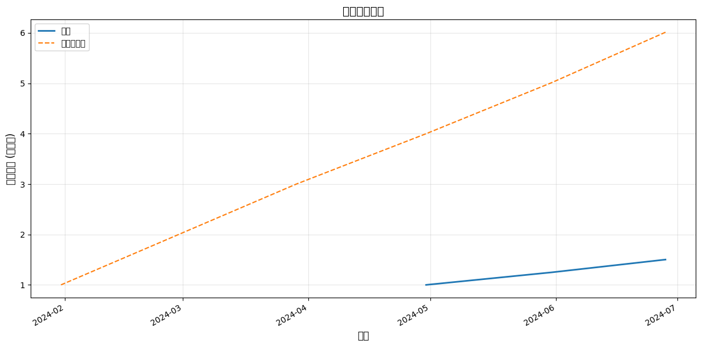
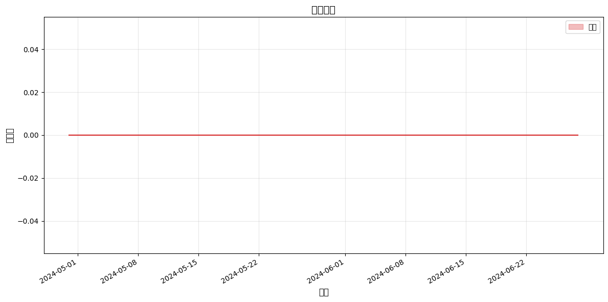
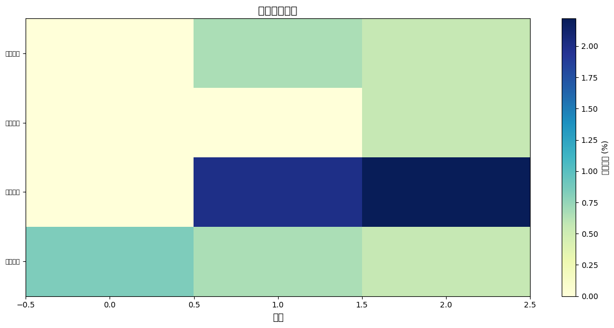

# 回测绩效报告

## 回测概览

- **回测期间**: 2024-01-01 至 2024-06-30
- **月度预算**: 3,000.00 元
- **回测月份**: 3 个月
- **总交易次数**: 9 笔

## 绩效指标

| 指标 | 值 |
|------|-----|
| 总收益率 | 50.20% |
| 年化收益率 | 1138.89% |
| 最大回撤 | 0.00% |
| 波动率 | 36.86% |
| 夏普比率 | 154.27 |
| Calmar比率 | 0.00 |
| IRR | 1138.89% |
| Sortino比率 | 0.00 |
| 胜率 | 100.00% |
| 盈利因子 | inf |
| 累计超额收益 | -149.80% |
| 超额收益波动率 | 211.84% |
| 信息比率 | -0.71 |
| 超额最大回撤 | -224.89% |
| 初始资产 | 11,995.00 |
| 最终资产 | 18,017.00 |
| 累计投入 | 9,000.00 |
| 累计收益 | 9,017.00 |

## 收益曲线

## 回撤曲线

## 资产配置

## 交易记录

| 日期 | 类型 | 标的 | 股数 | 价格 | 成本 | 佣金 | 原因 |
|------|------|------|------|------|------|------|------|
| 2024-04-30 | buy | 招商银行 | 100 | 29.33 | 2,933.00 | 5.00 | rebalance |
| 2024-05-31 | buy | 兴业银行 | 100 | 15.23 | 1,523.00 | 5.00 | rebalance |
| 2024-05-31 | buy | 工商银行 | 300 | 4.67 | 1,401.00 | 5.00 | rebalance |
| 2024-06-28 | buy | 双汇发展 | 100 | 20.91 | 2,091.00 | 5.00 | rebalance |
| 2024-06-28 | buy | 工商银行 | 100 | 4.94 | 494.00 | 5.00 | rebalance |

## 买入原因统计

| 原因 | 次数 | 占比 |
|------|------|------|
| rebalance | 5 | 100.0% |

## 基准对比

| 指标 | 策略 | 等权重定投 |
|------|------|------|
| 总收益率 | 50.20% | 501.37% |
| 年化收益率 | 1138.89% | 8002.70% |
| 最大回撤 | 0.00% | - |

---
报告生成时间: 2026-05-10 22:19:47